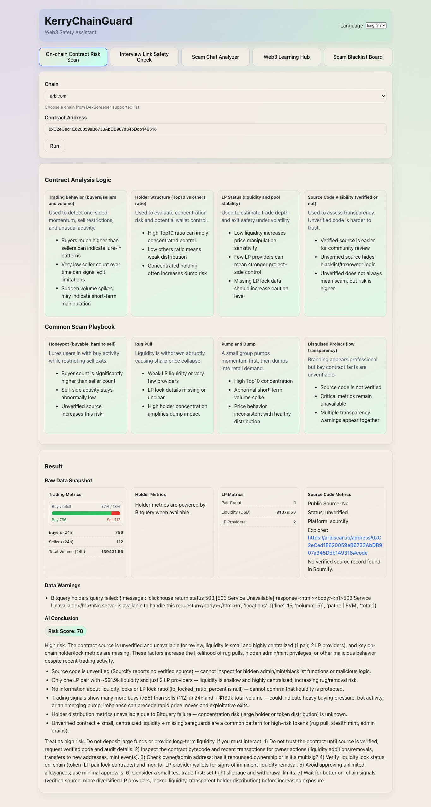

# KerryWeb3Guard



**Project Creator:** Telegram `@kerryzheng`

[中文文档 (Chinese README)](./README.zh-CN.md)
[Link](https://t.me/@kerryweb3guard)

KerryWeb3Guard is a lightweight Web3 safety assistant for daily users.
It helps users in five core scenarios:

- Contract interaction risk
- Interview / website link risk
- Chat scam risk
- Web3 education and onboarding for beginners
- Community scammer blacklist reporting

This MVP is intentionally simple:

- No risk engine
- No database
- No complex scoring pipeline
- LLM-based analysis with clear prompts
- Bilingual product experience (English + Chinese)

---

## Product Goal

Reduce scam probability for Web3 users by giving fast and understandable
risk analysis before users click, connect wallets, or transfer assets.

---

## Core Features

### 1) On-chain Contract Risk Scan

**Input**

- `chain` (e.g. ethereum, bsc, base)
- `contract_address`

**Data Source**

- DexScreener API

**MVP Logic**

1. Call DexScreener and extract three key signals:
   - Holder concentration
   - Liquidity status
   - Buy/Sell behavior
2. Send structured signal summary to LLM with a fixed prompt.
3. LLM returns risk assessment.

**Output**

- `risk_score` (0-100)
- `summary`
- `reasons`
- `advice`

---

### 2) Link Safety Check

**Input**

- `url`

**MVP Logic**

1. Provide URL (and optional fetched page text) to LLM.
2. Prompt asks LLM to analyze:
   - Suspicious domain patterns
   - Phishing-like wording
   - Wallet interaction risk
   - Official-brand consistency
3. LLM returns structured risk result.

**Output**

- `risk_score` (0-100)
- `summary`
- `reasons`
- `advice`

---

### 3) Scam Chat Analyzer

**Input**

- `chat_text`

**MVP Logic**

1. Send chat text to LLM with anti-scam analysis prompt.
2. Prompt asks LLM to identify:
   - Manipulative language
   - Scam patterns (FOMO, fake authority, urgent transfer)
   - Requested risky actions (transfer, approve, connect wallet)
3. LLM outputs classification and actionable advice.

**Output**

- `risk_score` (0-100)
- `scam_type`
- `summary`
- `evidence_points`
- `recommended_action`

---

### 4) Web3 Learning Hub

**Input**

- `topic` (optional)
- `user_question` (optional)
- `response_language` (`en` or `zh-CN`)

**MVP Logic**

1. Render a dedicated frontend page for beginner education.
2. Provide curated learning modules:
   - Wallet safety basics
   - Common scam patterns
   - Contract interaction checklist
   - Job interview safety checklist
3. When users ask questions, call LLM with a learning-focused prompt.
4. Force LLM to reply in the selected UI language.

**Output**

- `title`
- `summary`
- `key_points`
- `action_checklist`
- `quiz_questions` (optional)

---

### 5) Scam Blacklist Board

**Goal**

- Show confirmed scammer identities in a public frontend page
- Accept user reports with evidence screenshots
- Add scammer contact handles (for example Telegram IDs) after manual review

**Frontend Page**

- Blacklist table (display name, platform, contact handle, status, updated time)
- Report submission form
- Evidence upload area (screenshots and links)
- Case status tracker (submitted / under review / listed / rejected)

**MVP Logic (Human-in-the-loop)**

1. User submits suspected scammer details and screenshots.
2. Admin reviews evidence manually.
3. If confirmed, admin adds the scammer identity (such as TG name) to blacklist.
4. The list is published on the blacklist page.

**Output / Public Fields**

- `scammer_display_name`
- `platform` (e.g. Telegram, X, Discord)
- `contact_handle`
- `evidence_summary`
- `review_status`
- `updated_at`

---

## Unified Response Format (Recommended)

```json
{
  "module": "contract_risk_scan",
  "risk_score": 88,
  "summary": "This token shows high manipulation risk.",
  "reasons": [
    "Top holders are highly concentrated",
    "Liquidity appears weak or unsafe",
    "Buy/Sell behavior is abnormal"
  ],
  "advice": "Do not interact with this contract."
}
```

---

## Bilingual Product Requirement (UI + AI)

The project default language is English for code and technical docs.
Chinese support is provided for end users and community documentation.

### Frontend i18n

- UI must support runtime language switch: `en` / `zh-CN`
- All labels, buttons, validation messages, and tips are localized
- User language preference should persist locally

### AI Output Language

- Every scan and learning request should include `response_language`
  (`en` or `zh-CN`)
- Prompt templates must instruct the LLM to reply in the requested language
- Output schema stays identical across languages

### Documentation Language Policy

- `README.md`: English (primary)
- `README.zh-CN.md`: Chinese translation
- Keep both docs aligned when product scope changes

---

## Technical Principles (MVP)

- Backend: FastAPI
- LLM orchestration: prompt templates + single LLM call per module
- Data storage: none (no DB in MVP)
- Architecture: keep code modular for easy future upgrade

Suggested backend layout:

```text
backend/risk-service/
  app/
    api/
    schemas/
    services/
    providers/
    core/
```

---

## Quick Start (Scaffold)

### Backend

```bash
cd backend/risk-service
cp .env.template .env
uv sync
uv run uvicorn app.main:app --reload --host 0.0.0.0 --port 8000
```

### Frontend

```bash
cd frontend/web
cp .env.template .env
npm install
npm run dev
```

### Required API Keys

- `OPENAI_API_KEY` (required for AI responses)
- `BITQUERY_API_KEY` (required for holder and LP provider metrics)
- `OPENAI_MODEL` (optional, default `gpt-4o-mini`)

---

## Suggested API Endpoints

- `POST /api/v1/scan/contract`
- `POST /api/v1/scan/link`
- `POST /api/v1/scan/chat`
- `POST /api/v1/learn/web3`
- `POST /api/v1/blacklist/report`
- `GET /api/v1/blacklist`
- `PATCH /api/v1/blacklist/{case_id}` (admin review)
- `GET /api/v1/meta/chains` (DexScreener-supported chain params for dropdown)
- `GET /api/v1/meta/verify-keys` (validate OpenAI and Bitquery keys)

Suggested request extension for all endpoints:

- `response_language`: `en` or `zh-CN`

---

## Important Disclaimer

KerryWeb3Guard provides risk hints only.
It is not financial advice or legal advice.
Users should still verify information independently before any wallet
connection, signature, approval, or transfer.

Blacklist entries are based on submitted evidence and manual review.
To reduce false accusations, include an appeal/contact channel and avoid
publishing sensitive personal data beyond what is needed for safety alerts.

---

## Future Upgrades (Optional)

- Add deterministic rule checks before LLM
- Add wallet approval scanner
- Add browser extension
- Add report history and user dashboard
