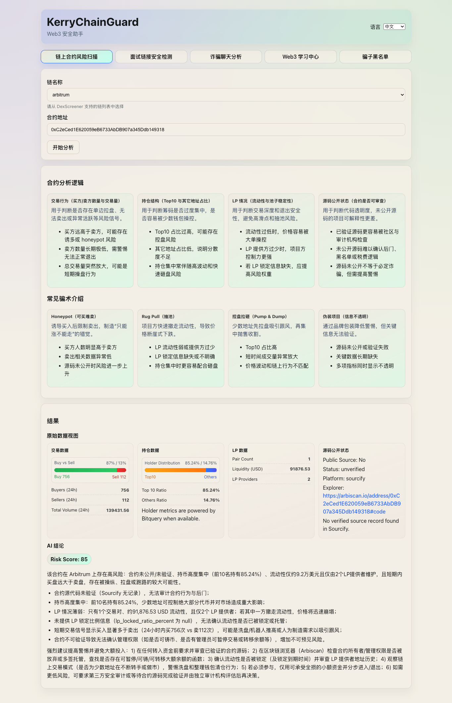

# KerryWeb3Guard



**项目创作者：** Telegram `@kerryzheng`

[English README](./README.md)
[访问链接](https://t.me/@kerryweb3guard)

KerryWeb3Guard 是一个轻量化的 Web3 安全助手。
它帮助用户覆盖五个核心场景：

- 合约交互风险
- 面试/官网链接风险
- 聊天诈骗风险
- Web3 新手学习与入门
- 社区骗子黑名单举报与公示

当前 MVP 刻意保持简单：

- 不接数据库
- 不做复杂评分流水线
- 基于清晰 Prompt 的 LLM 分析
- 支持中英文双语产品体验

---

## 项目目标

在用户点击链接、连接钱包、签名或转账前，提供快速且可理解的
风险提示，降低 Web3 用户受骗概率。

---

## 核心功能

### 1) On-chain Contract Risk Scan（链上合约风险扫描）

**输入**

- `chain`（例如 ethereum、bsc、base）
- `contract_address`

**数据来源**

- DexScreener API

**MVP 逻辑**

1. 调用 DexScreener，提取三个关键维度：
   - 持仓集中度
   - 流动性状态
   - 买卖行为
2. 将结构化结果送入固定 Prompt。
3. LLM 直接输出风险结论。

**输出**

- `risk_score`（0-100）
- `summary`
- `reasons`
- `advice`

---

### 2) Link Safety Check（面试链接安全检测）

**输入**

- `url`

**MVP 逻辑**

1. 将 URL（可选页面文本）提供给 LLM。
2. Prompt 要求 LLM 分析：
   - 域名可疑模式
   - 钓鱼文案特征
   - 钱包交互风险
   - 与官方一致性
3. LLM 返回结构化结果。

**输出**

- `risk_score`（0-100）
- `summary`
- `reasons`
- `advice`

---

### 3) Scam Chat Analyzer（诈骗聊天分析）

**输入**

- `chat_text`

**MVP 逻辑**

1. 将聊天文本输入 LLM 反诈 Prompt。
2. Prompt 要求识别：
   - 操控性话术
   - 常见诈骗模式（FOMO、权威伪装、催促转账）
   - 高风险行为引导（转账、授权、连接钱包）
3. LLM 输出类型判断与行动建议。

**输出**

- `risk_score`（0-100）
- `scam_type`
- `summary`
- `evidence_points`
- `recommended_action`

---

### 4) Web3 Learning Hub（Web3 学习中心）

**输入**

- `topic`（可选）
- `user_question`（可选）
- `response_language`（`en` 或 `zh-CN`）

**MVP 逻辑**

1. 提供独立前端页面，面向新手做 Web3 科普与入门引导。
2. 内置学习模块：
   - 钱包安全基础
   - 常见诈骗类型
   - 合约交互前检查清单
   - 面试与招聘安全检查清单(基于abetterweb3的入门系列教程实现)
3. 用户提问时，调用 LLM 学习型 Prompt 生成讲解内容。
4. 强制 LLM 跟随界面语言输出（中/英文）。

**输出**

- `title`
- `summary`
- `key_points`
- `action_checklist`
- `quiz_questions`（可选）

---

### 5) Scam Blacklist Board（骗子黑名单）

**目标**

- 在前端页面公示已确认的骗子身份信息
- 接收用户提交的举报与截图证据
- 经你人工审核后，把骗子联系方式（如 TG 名称）加入黑名单

**前端页面**

- 黑名单列表（名称、平台、联系方式、状态、更新时间）
- 举报提交通道
- 证据上传区（截图、链接）
- 案件状态跟踪（已提交 / 审核中 / 已公示 / 已驳回）

**MVP 逻辑（人工审核）**

1. 用户提交可疑对象信息与截图。
2. 管理员人工审核证据。
3. 审核通过后，将骗子身份（如 TG 名称）加入黑名单。
4. 前端黑名单页面展示更新后的记录。

**对外展示字段**

- `scammer_display_name`
- `platform`（如 Telegram、X、Discord）
- `contact_handle`
- `evidence_summary`
- `review_status`
- `updated_at`

---

## 统一输出格式（建议）

```json
{
  "module": "contract_risk_scan",
  "risk_score": 88,
  "summary": "This token shows high manipulation risk.",
  "reasons": [
    "Top holders are highly concentrated",
    "Liquidity appears weak or unsafe",
    "Buy/Sell behavior is abnormal"
  ],
  "advice": "Do not interact with this contract."
}
```

---

## 双语要求（前端界面 + AI 输出）

项目代码与主文档使用英文；中文用于用户展示与社区传播。

### 前端 i18n

- 前端页面必须支持运行时切换：`en` / `zh-CN`
- 文案、按钮、校验提示、引导说明都要可翻译
- 用户语言偏好应本地持久化

### AI 回复语种

- 所有扫描与学习接口增加 `response_language`（`en` 或 `zh-CN`）
- Prompt 必须明确要求 LLM 使用目标语言回复
- 不同语种共用同一输出字段结构

### 文档策略

- `README.md`：英文主文档
- `README.zh-CN.md`：中文翻译文档
- 功能变化时，两份文档保持同步更新

---

## 技术原则（MVP）

- Backend: FastAPI
- LLM 编排：Prompt 模板 + 每个模块单次 LLM 调用
- 数据存储：无（MVP 不接 DB）
- 架构：保持模块化，方便后续升级

建议目录：

```text
backend/risk-service/
  app/
    api/
    schemas/
    services/
    providers/
    core/
```

---

## 快速启动（脚手架）

### 后端

```bash
cd backend/risk-service
cp .env.template .env
uv sync
uv run uvicorn app.main:app --reload --host 0.0.0.0 --port 8000
```

### 前端

```bash
cd frontend/web
cp .env.template .env
npm install
npm run dev
```

### 必填 API Key

- `OPENAI_API_KEY`（AI 输出必填）
- `BITQUERY_API_KEY`（持仓与 LP provider 数据必填）
- `OPENAI_MODEL`（可选，默认 `gpt-4o-mini`）

---

## 建议 API

- `POST /api/v1/scan/contract`
- `POST /api/v1/scan/link`
- `POST /api/v1/scan/chat`
- `POST /api/v1/learn/web3`
- `POST /api/v1/blacklist/report`
- `GET /api/v1/blacklist`
- `PATCH /api/v1/blacklist/{case_id}`（管理员审核）
- `GET /api/v1/meta/chains`（用于前端链下拉框）
- `GET /api/v1/meta/verify-keys`（验证 OpenAI 和 Bitquery key）

所有接口建议统一支持：

- `response_language`: `en` 或 `zh-CN`

---

## 免责声明

KerryWeb3Guard 仅提供风险提示，不构成投资建议或法律建议。
在进行钱包连接、签名、授权、转账前，用户仍需自行核验。

黑名单记录基于用户提交证据与人工审核结果。为降低误伤风险，
建议提供申诉通道，并避免公开不必要的敏感个人信息。

---

## 可选后续方向

- 在 LLM 前加入确定性规则校验
- 增加钱包授权风险检测
- 增加浏览器插件版本
- 增加报告历史与用户面板
